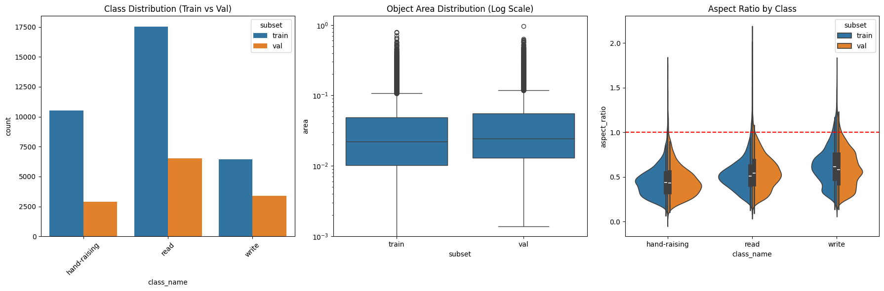
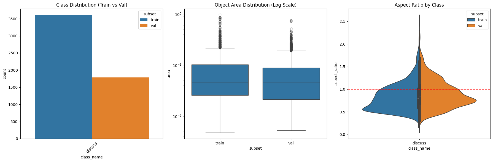
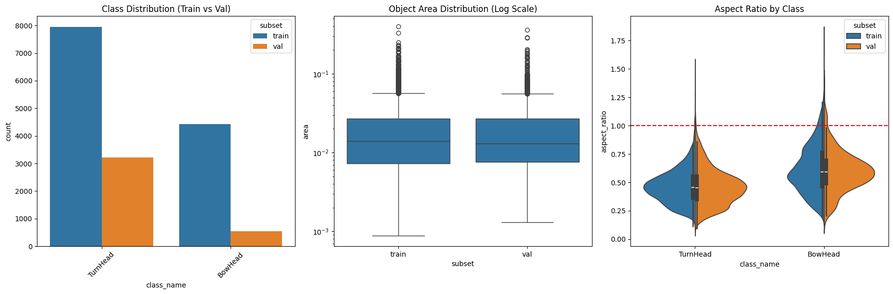
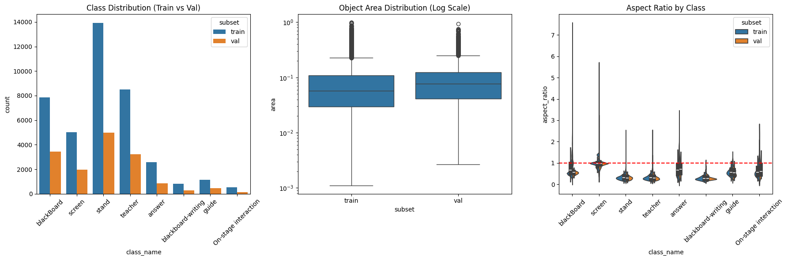
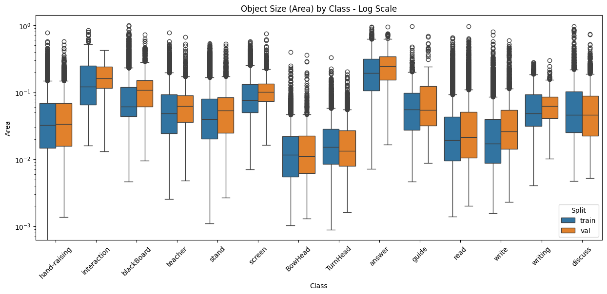
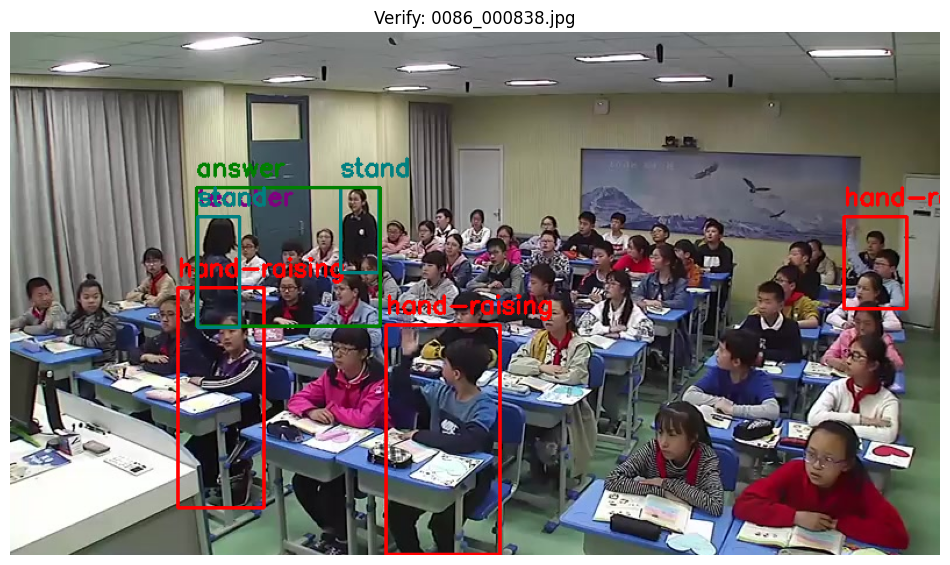

# Team Overclocked - Nural nexus (Education)

**In phase 1** we were give a problem to devlop and desgin a ai/ml based system which can analyse multimodal classroom behavior from the given dataset , it aims to detect and classify student engagement and activity during a live teaching session.

# E.D.A(Exploratory Data Anaylsis) and Pre-processing #

## E.D.A 
* The data set provided to us contained ** 22 categories **which includes : 
1.Discussion  
2.Answering question  
3.Listening to lecture  
4.Lecturing  
5.Guidance_coaching 
6.Reading aloud 
7.Reading and writing 
8.SCB5-Handrise-Read-write-2024-9-17_images_val 
9.SCB5-Handrise-Read-write-2024-9-17_images_train 
10.SCB5-Discuss-2024-9-17_images_train 
11.SCB5-Discuss-2024-9-17_images_val 
12.SCB5_Teacher_Behavior_Stand_BlackBoard_Screen_20250406-2_images_val 
13.SCB_BowTurnHead_20250509_SCB5-Turn-Bow-Head-2024-9-17_images_train 
14.SCB5_Teacher_Behavior_Stand_BlackBoard_Screen_20250406-2_images_train 
15.SCB_BowTurnHead_20250509_SCB5-Turn-Bow-Head-2024-9-17_images_val 
16.Student hand-raise 
17.teacher patrolling 
18.Student at blackboard 
19.Stage interaction 
20.Stage demonstration 
21.Teacher at blackboard 
22.Teacher responding 

* out of which we elemented categories as the data of these **7 categories** were faulty(unsupported format) :  
 1.Discussion 
2.Answering question  
3.Listening to lecture 
4.Lecturing 
5.Guidance_coaching 
6.Reading aloud 
7.Reading and writing 
*

# Pre-Processing

* further we performed data **augmentation** in which we used *rotating* ,*greyscaling*,*pixel cliping*,*geometric transformation* and *frame resizing*.
* we divide the dataset into 3 parts:
1. trained 
* 60% of the original data.
2. test
* 20% of the data set.
3. validation
* 20% of the data to validated.

* we used **image enhancement** which involved *sharping* and *ray scaling*.
* for a faster and smooth data processing and performace we used cude as we have gtx 1650 with about thousand cuda cores for a faster processing of the data set.

* this is the example of the final model:-

